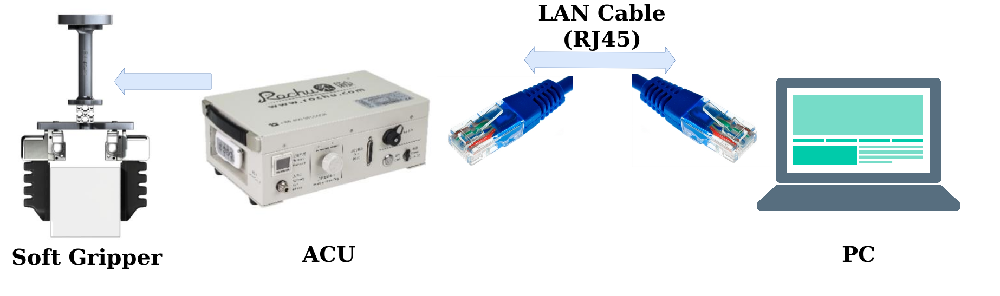
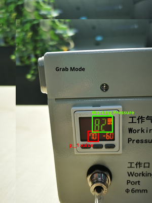
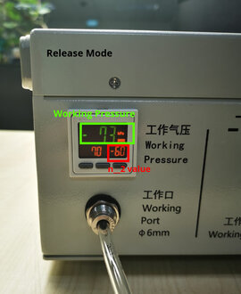
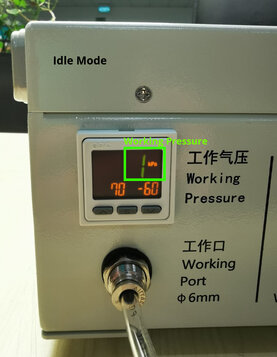

# Rochu A5V4 Soft Gripper
Sensor package control the Rochu A4V5 Soft Gripper.  The Soft Gripper is connected to the Rochu Active Control Unit (ACU) to provide adjustable pressure to the pneumatic gripper. To communicate with the ACU, ModBus TCP protocol is used.

# Prerequisites
1. ROS2 Eloquent Elusor running on Ubuntu 18.04 LTS.
2. RJ45 Cable
3. Python Library: [pyModbusTCP 0.1.8](https://pymodbustcp.readthedocs.io/en/latest/). You can install with : `pip3 install pyModbusTCP`

# Hookup Guide
## Hardware hookup
Below is a graphical representation for the hookup instructions between your computer and the gripper.


## Setting up a static IP
As the ModBus TCP protocol requires your pc to communicate with the ACU over your local area network, a static ip is required for the PC to connect to the Modbus. Please refer to the guide on how to set a static ip for Ubuntu 18.04 ([here](https://linuxize.com/post/how-to-configure-static-ip-address-on-ubuntu-18-04/))

# Build the project
## Source the ROS2 Environment:
The exact source command may vary, please find more ([here](https://index.ros.org/doc/ros2/Installation/Eloquent/))
```sh
$ source /opt/ros/eloquent/setup.bash
```
### Create a workspace and a source directory:
```sh
$ mkdir -p dev_ws/src
```

### Clone the repo:
Inside the `dev_ws/src` directory, clone the github repo:
```sh
$ git clone https://github.com/RMFHOPE/rochu_soft_gripper.git
```

### Build the workspace with colcon
From the root of the workspace `dev_ws`, build the `rochu_gripper` and the `rochu_gripper_msgs` package:
```sh
$ colcon build --merge-install --packages-select rochu_gripper_msgs
$ colcon build --merge-install --packages-select rochu_gripper
```

# Run the project
The ROS2 wrapper node `rochu_gripper_fma5_node.py` instantiates the Rochu Gripper class in `rochu_gripper_fma5_class.py`. Note that to successfully do so, the static ip must be set, otherwise, the handshake will not be successful.
## Running the rochu_gripper node
In a new terminal, source the main ROS2 environment as the underlay:
```sh
$ source /opt/ros/eloquent/setup.bash
```

In the root of your workspace `dev_ws`, source the overlay:
```sh
$ source install/setup.bash
```
These are a few ways to run the node.
1. Run the node with default params:
```sh
$ ros2 run rochu_gripper rochu_gripper_node 
```
2. Run the node with param file loaded , for more description for the parameters, please find parameters description below:
```sh
$ ros2 run rochu_gripper rochu_gripper_node --ros-args --params-file <path_to_your_workspace>/src/rochu_gripper/config/params.yaml 
```
3. Run the launch file with params.yaml:
```sh
$ colcon build --packages-select rochu_gripper && ros2 launch rochu_gripper example.launch.xml
```
# Parameters description
1. rochu.name : specific id for each gripper when multiple grippers is running.
2. rochu.ip : IP of ACU for ModBus TCP communication. Default ip is set as `192.168.1.200` , contact supplier for different IPs registered.
3. rochu.port: Port for ModBus TCP communication. Default port is set as `502`, contact supplier for change of port.
## Controlling input parameters
4. rochu.max_effort: Upper bound for the positive pressure that controls the gripper (kPa). Max working pressure for the A5V4 model is 120kPa.
5. rochu.min_effort: Lower bound for the positive pressure that controls the gripper (kPa). Min working pressure for the A5V4 model is 0kPa.
### Pressured Applied = min_effort + (percentage * (max_effort-min_effort)) 

# Things to note
In the `rochu/state/current_mode` topic , the mode is decided by the feedback from the ACU.
For current_mode= MODE_GRAB
Current pressure has to exceed the `P_1` value you have set on the ACU, refer to the image below: <br/>
 <br/>

For current_mode= MODE_RELEASE
Current pressure has to fall below the `n_2` value you have set on the ACU, refer to the image below: <br/>
 <br/>

For current_mode= MODE_IDLE
Neither of both of the above cases. <br/>
<br/>